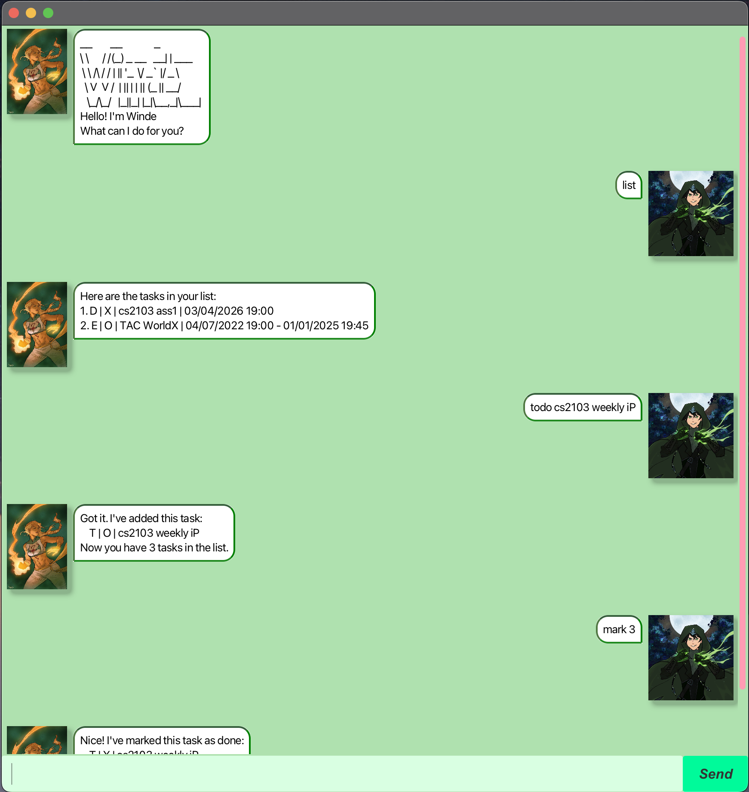

# Winde User Guide



Welcome to WindeBot! The best reminder bot in the entire WindeLand

Winde Bot is a task management tool designed to help users organise their daily tasks, events, and deadlines. It supports various types of tasks including general to-dos, time-sensitive deadlines, and events with specific start and end times. Winde Bot makes use of natural language commands to add, delete, and mark tasks as complete or incomplete.

Here the list of features we have!

**Add Tasks:** Create new to-do items, deadlines, or events.

**List Tasks:** Display all current tasks.

**Mark Tasks:** Mark tasks as completed or uncompleted.

**Delete Tasks:** Remove tasks from the list.

**Find Tasks:** Search for tasks by keyword.

**Date Tasks:** Find the tasks you have to do on a certain day.

To start using Winde Bot, you can interact with the bot by typing commands in the terminal. Each command will prompt the bot to perform a specific action such as adding a task, marking a task as completed, or listing all tasks.
Here are the list of commands you can input!

## Adding To-dos

This will add a Todo task for you to do with no end date

Command:

`todo <description>`

Example:

`todo buy groceries`

Output:
```
Got it. I've added this task:
[T][O] buy groceries
Now you have 1 task in the list.
```

## Adding Deadline

This will add a Deadline task for you to do with a deadline date

Command:

`deadline <description> /by <yyyy-mm-dd hh:mm>`

Example:

`deadline submit assignment /by 2023-12-10 23:59`

Output:
```
Got it. I've added this task:
[D][O] submit assignment (by: Dec 10 2023, 11:59PM)
Now you have 2 tasks in the list.
```

## Adding Event

This will add a Event task for you to do with a Start and End date

Command: 

`event <description> /from <yyyy-mm-dd hh:mm> /to <yyyy-mm-dd hh:mm>`

Example: 

`event team meeting /from 2023-12-01 14:00 /to 2023-12-01 15:00`

Output:
```
Got it. I've added this event:
[E][O] team meeting (from: Dec 1 2023, 2:00PM to: Dec 1 2023, 3:00PM)
Now you have 3 tasks in the list.
```

## Listing Tasks

This will list out all the tasks you have

Command:

`list`

Output:
```
Here are the tasks in your list:
1. [T][O] buy groceries
2. [D][O] submit assignment (by: Dec 10 2023, 11:59PM)
3. [E][O] team meeting (from: Dec 1 2023, 2:00PM to: Dec 1 2023, 3:00PM)
```

## Marking Tasks

This will Mark a task as complete

Command: 

`mark <task number>`

Example: 

`mark 1`

Output:
```
Nice! I've marked this task as done:
[T][X] buy groceries
```

## Unmarking Tasks

This will Unmark a task as incomplete

Command: 

`unmark <task number>`

Example: 

`unmark 1`

Output:
```
OK, I've marked this task as not done yet:
[T][O] buy groceries
```

## Deleting Tasks

This will Delete a task

Command: 

`delete <task number>`

Example: 

`delete 1`

Output:
```
Noted. I've removed this task:
[T][O] buy groceries
Now you have 2 tasks in the list.
```

## Finding Tasks

This will Find a task in your list

Command: 

`find <keyword>`

Example: 

`find meeting`

Output:
```
Here are the matching tasks in your list:
1. [E][O] team meeting (from: Dec 1 2023, 2:00PM to: Dec 1 2023, 3:00PM)
```

## Getting Tasks a Date

This will Find all the tasks on a specific date

Command:

`date <yyyy-mm-dd hh:mm>`

Example:

`date 2023-12-10 23:59`

Output:
```
Here are the matching tasks in your list:
1. [D][O] submit assignment (by: Dec 10 2023, 11:59PM)
```

## Feature: Error Handling

Winde Bot has built-in error handling. If a command is incomplete or has incorrect syntax, Winde will notify the user with a helpful message.

Example:

`todo`

Response:
```
OOPS!!! The description of a todo cannot be empty.
```


## Feature: Saving and Loading Tasks
Winde Bot automatically saves tasks to the file system whenever the task list is modified. When you reopen the application, tasks will be loaded from the disk.